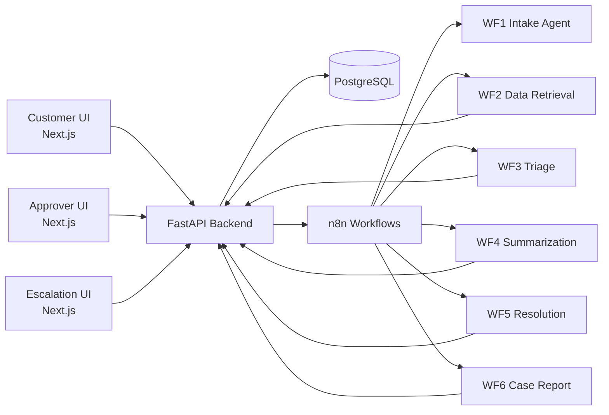
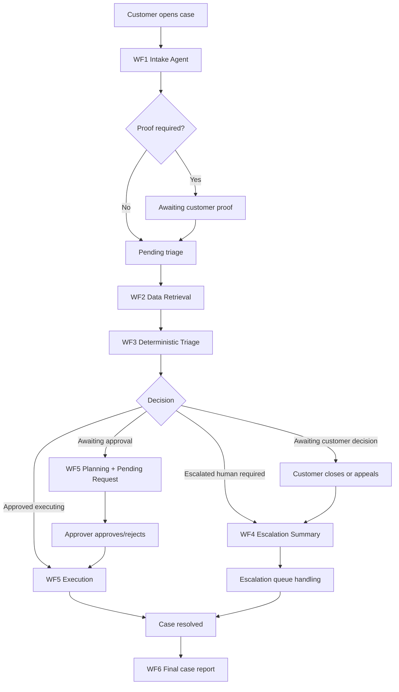

<div align="center">
  <h1>🦁 ROAR Engine</h1>
  <p><b>Retail Operations and Resolution Engine</b></p>

  [](#-tech-stack)
  [](#-tech-stack)
  [](#-workflow-automation-n8n-pipeline)
  [](#-tech-stack)
</div>

---

**ROAR Engine** is a supervised agentic dispute-resolution platform tailored for online retail support. It bridges the gap between chaotic customer support chats and enterprise backend systems (Order Management, Payment Gateways, Logistics, and Inventory). 

By leveraging a deterministic triage engine and six specialized n8n AI workflows, ROAR automates case intake, context retrieval, decision-making, and resolution execution. It safely escalates only the disputes that require human touch, heavily reducing agent workload and resolution times, while integrating seamlessly with **FastAPI** and **PostgreSQL**.

---

## 🌟 Core Features

### 🛍️ Customer Experience
- **Guided Intake:** Dynamically adjusting follow-up questions replace static forms, guided structurally by the Intake Agent.
- **Evidence Management (`awaiting_customer_proof`):** Dynamically pauses triage to securely collect mandatory proof images (e.g., damaged goods) before routing.
- **Option Branching (`awaiting_customer_decision`):** Enables the customer to make clear choices before the system finalizes resolution logic.
- **Structured Response Pills:** Quick-reply controls for common deterministic branches.
- **Floating Controls:** Destructive end-conversation controls with safe fallbacks.

### 🤖 Deterministic Triage (WF3)
- **Threshold-based Logic:** Automatic approval workflows driven by hardcoded thresholds and rules.
- **Proof-Aware Context:** Detects contradictions or insufficiencies in uploaded order evidence.
- **Validation Guardrails:** Verifies *Payment Confirmations*, *Delivery SLA breaches*, and *Inventory constraints* across disparate data sources before drafting resolutions.
- **Customer Decision Routing:** Handles edge cases implicitly by requesting options or safely routing invalid inquiries.

### 🛡️ Human Operations & Approvals
- **Approver Dashboard:** Specialized cards and action panels to approve, reject, or modify *refund, return, and replacement* requests.
- **Escalation Queue:** Claim-and-handle flows for human CX agents injected exactly when AI fails, disputes escalate, or data inconsistencies arise.
- **Comprehensive Summaries:** Instant context handoffs outlining exactly *why* a case escalated and *what* rules passed/failed.

---

## 🧠 Workflow Automation (n8n pipeline)

ROAR utilizes **six distinct n8n workflows** strictly decoupled from direct UI layers, operating behind FastAPI webhooks.

| Workflow | Agent Responsibility | Outcome |
| :---: | :--- | :--- |
| **`WF1`** | **Intake & Follow-up** | State-aware follow-ups, proof gating, intent classification |
| **`WF2`** | **Data Retrieval** | Safe backend querying to compile the `information_bundle` |
| **`WF3`** | **Deterministic Triage** | Path routing: Autonomous, Escalated, or Pending Customer Action |
| **`WF4`** | **Summarization** | Human-safe escalation summary generation |
| **`WF5`** | **Resolution Execution** | Resolution planning, request record creation, final case resolution |
| **`WF6`** | **Case Report** | Final end-to-end report generation on conversation close |

*(Workflow files exported in [`n8n/workflows`](./n8n/workflows))*

---

## 🏛️ Architecture

<details>
<summary><strong>View System Diagram</strong></summary>


*Note: n8n pipelines query the database safely via `/internal/` FastAPI endpoints rather than direct DB coupling.*
</details>

<details>
<summary><strong>View Case Resolution Flow</strong></summary>


</details>

---

## 🛠️ Tech Stack

- **Frontend:** Next.js 14, React 18, TypeScript, Tailwind CSS, shadcn-based components
- **Backend:** FastAPI, Python, SQLAlchemy, Pydantic, python-jose (JWT auth)
- **AI/Automation:** n8n, OpenAI (GPT-4o-mini), LangChain pipelines
- **Database:** PostgreSQL (Hosted on Railway)
- **Deployment:** Vercel (Web), Railway (API + n8n + DB) 

---

## 📂 Repository Structure

```text
ROAR/
├── api/        # FastAPI backend, routers (cases, auth, replacement_requests, internal), models
├── web/        # Next.js frontend (Customer chat, Approver dashboards)
├── n8n/        # Workflow exports (.json) and guides
├── db/         # PostgreSQL schema/migrations and mock seed data
├── docs/       # Comprehensive PRD, Architecture, logic mapping, and internal schemas
├── scripts/    # Utility tools and wiping scripts
└── output/     # Generated test tracking reports
```

---

## 🚀 Quick Start

### Prerequisites
- Node.js LTS & npm
- Python 3.11+
- Local PostgreSQL instance
- Docker Desktop
- A local or hosted target of **n8n**

### Easiest Local Startup (Windows)
```bat
bootup.bat     # Launches PostgreSQL, n8n, FastAPI, and Frontend in sequence
shutdown.bat   # Cleans up containers and services
```

<details>
<summary><strong>Manual Startup Steps</strong></summary>

**Frontend:**
```bash
cd web
npm install
npm run dev
```

**Backend:**
```bash
cd api
pip install -r requirements.txt
uvicorn main:app --reload --host 0.0.0.0 --port 8000
```
Then import the workflow `json` files from `n8n/workflows/` directly into your local n8n instance and configure credentials.
</details>

---

## 📚 Documentation Map

The engine's logic is tightly tracked against its internal design documents. *Note: The physical filenames may hold a slightly older version tag to preserve links, but the internal logical versions are actively maintained up to `v1.3`.*

### Product & Design Docs
- [`docs/ROAR_PRD_v1.2.md`](./docs/ROAR_PRD_v1.2.md) *(Internal v1.3)*
- [`docs/ROAR_Architecture_v1.1.md`](./docs/ROAR_Architecture_v1.1.md) *(Internal v1.2)*
- [`docs/ROAR_BRL_v1.1.md`](./docs/ROAR_BRL_v1.1.md) *(Internal v1.2)*
- [`docs/ROAR_PBD_v1.1.md`](./docs/ROAR_PBD_v1.1.md) *(Internal v1.2)*
- [`docs/ROAR_ResolutionPaths_v1.md`](./docs/ROAR_ResolutionPaths_v1.md) *(Internal v1.1)*

### Workflows & Logic
- [`docs/ROAR_n8n_Spec_v2.1.md`](./docs/ROAR_n8n_Spec_v2.1.md) *(Internal v2.2)*
- [`docs/ROAR_Policies_v1.md`](./docs/ROAR_Policies_v1.md) *(Internal v1.1)*
- [`docs/ROAR_WF_Manual_Mapping_Guide_Decision_Matrix.md`](./docs/ROAR_WF_Manual_Mapping_Guide_Decision_Matrix.md)

### Verification
- [`docs/ROAR_Manual_E2E_Run_Guide.md`](./docs/ROAR_Manual_E2E_Run_Guide.md)
- [`docs/ROAR_Full_Features.md`](./docs/ROAR_Full_Features.md)

---

> Built for highly accurate and fast retail customer support resolution. Maintain the integrity of `db/seed/` scenarios to trace AI decisions natively.
